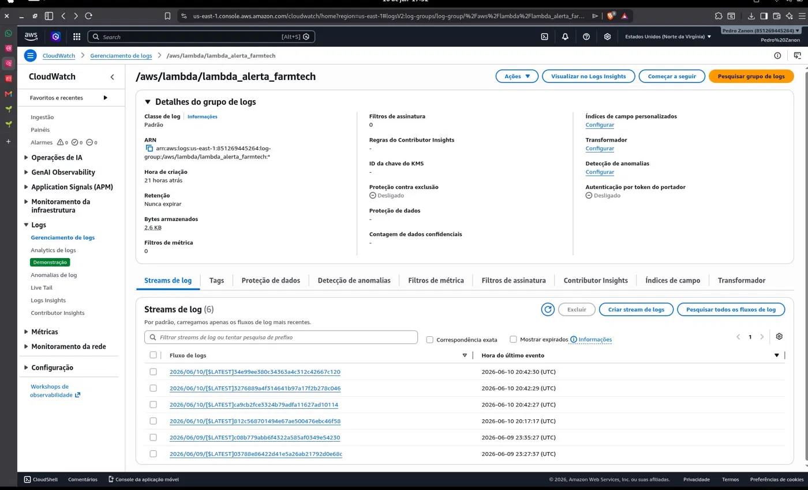
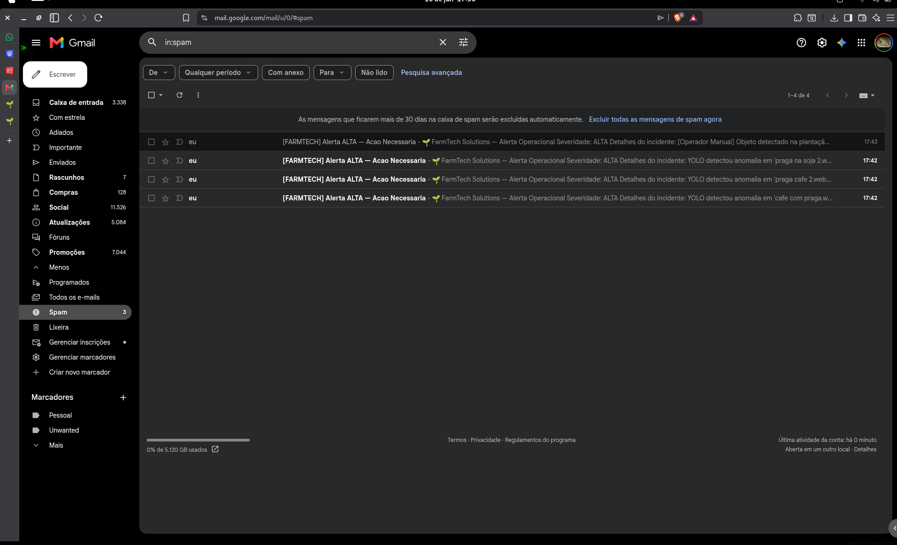

# 🌱 FarmTech Solutions — Fase 7

Sistema integrado de gestão agrícola inteligente desenvolvido para a disciplina de IA da FIAP.
Integra sensores IoT, banco de dados relacional, machine learning, visão computacional e alertas em nuvem AWS em uma única dashboard Streamlit.

> 🎥 **Vídeo demonstrativo:** [INSERIR LINK DO YOUTUBE]

---

## 📁 Estrutura do Projeto

```
farmtech-solution-fase7/
├── fase1_base_dados/
│   ├── calculo_area.py          # área e volume de plantio (café e soja)
│   ├── manejo_insumos.py        # doses de fertilizante e defensivos
│   ├── api_meteorologica.py     # consome Open-Meteo e gera CSV
│   ├── analise_r.R              # estatística dos dados meteorológicos em R
│   └── dados_meteorologicos.csv # base gerada pela API
├── fase2_banco_dados/
│   ├── schema.sql               # DDL: tabelas, FKs, índices, seed
│   ├── conexao_db.py            # conexão reutilizável com SQLite
│   ├── crud_operacoes.py        # CRUD do manejo agrícola (talhões)
│   ├── farmtech.db              # banco de dados SQLite
│   └── mer_der.png              # diagrama MER/DER
├── fase3_iot/
│   ├── esp32_irrigacao.ino      # sketch do ESP32 (simulado no Wokwi)
│   ├── sensor_dht22.py          # leitura de umidade/temperatura
│   ├── sensor_ldr_ph.py         # simulação de pH via LDR
│   ├── logica_bomba.py          # regra de acionamento da bomba
│   └── crud_sensores.py         # grava leituras no banco
├── fase4_dashboard/
│   ├── app.py                   # entry point Streamlit — hub central
│   ├── ml_modelo.py             # RandomForest para previsão de irrigação
│   ├── visualizacoes.py         # gráficos interativos com Plotly
│   ├── predicoes_irrigacao.py   # recomendações automáticas de manejo
│   ├── requirements.txt         # dependências do projeto
│   └── pages/
│       ├── pg_sensores.py       # aba IoT + ML
│       ├── pg_visao_comp.py     # aba YOLO
│       └── pg_alertas.py        # aba alertas AWS
├── fase5_cloud_aws/
│   ├── alerta_sns.py            # publica alertas no SNS
│   ├── lambda_alertas.py        # Lambda: SNS → SES → e-mail
│   ├── infra_aws.md             # arquitetura AWS completa
│   ├── politica_seguranca.md    # ISO 27001/27002 aplicadas
│   └── prints_aws/              # evidências do console AWS
├── fase6_visao_computacional/
│   ├── detector_yolo.py         # carrega YOLOv8 e executa inferência
│   ├── inferencia.py            # processa lote de imagens
│   ├── imagens_teste/           # imagens de lavoura para teste
│   └── modelos/                 # pesos do modelo YOLO
├── docs/
│   ├── doc_fases_1_2_3.md
│   ├── doc_fases_4_6.md
│   └── doc_fase5.md
├── .env.example                 # variáveis de ambiente (modelo)
├── .gitignore
└── requirements.txt
```

---

## 🚀 Como Rodar

### Pré-requisitos
- Python 3.10+
- R instalado (para `analise_r.R`)
- Credenciais AWS configuradas (para alertas)

### Instalação

```bash
git clone https://github.com/VictorAraujopy/farmtech-solution-fase7
cd farmtech-solution-fase7
pip install -r fase4_dashboard/requirements.txt
```

### Configurar variáveis de ambiente

Crie um arquivo `.env` na raiz do projeto:

```
SNS_TOPIC_ARN=arn:aws:sns:us-east-1:SUA_CONTA:topicoalertafarmtech
AWS_ACCESS_KEY_ID=SUA_ACCESS_KEY
AWS_SECRET_ACCESS_KEY=SUA_SECRET_KEY
AWS_DEFAULT_REGION=us-east-1
```

### Inicializar o banco

```bash
cd fase2_banco_dados
python3 conexao_db.py
cd ..
```

### Subir a dashboard

```bash
streamlit run fase4_dashboard/app.py
```

### Rodar módulos individuais

```bash
# Fase 1 — Meteorologia e cálculos
cd fase1_base_dados
python3 api_meteorologica.py     # gera dados_meteorologicos.csv
Rscript analise_r.R              # análise estatística em R

# Fase 3 — Simular sensores IoT
cd fase3_iot
python3 crud_sensores.py         # simula leituras e grava no banco

# Fase 5 — Testar alerta AWS
cd fase5_cloud_aws
python3 -c "import alerta_sns; print(alerta_sns.verificar_sensor_e_alertar(25.0, 1800, 0, 0, 0))"
```

---

## 🌦️ Fase 1 — Base de Dados

Implementa os cálculos de área e manejo de insumos para dois tipos de talhão:

| Cultura | Geometria | Cálculo de área |
|---------|-----------|-----------------|
| Café | Retangular | `comprimento × largura` |
| Soja | Circular (pivô central) | `π × raio²` |

A API meteorológica usa a **Open-Meteo** (gratuita, sem chave) para coletar leituras horárias de temperatura, umidade, precipitação e vento da região de Ribeirão Preto/SP, gravando em `dados_meteorologicos.csv`. O script `analise_r.R` calcula média, desvio padrão, mínimo e máximo de cada variável.

**Simulação no Wokwi:** https://wokwi.com/projects/444286931892308993

---

## 🗄️ Fase 2 — Banco de Dados Relacional

Banco SQLite com 3 tabelas relacionadas:

```
culturas (1) ──── (N) talhoes (1) ──── (N) leituras_sensores
```

- **`culturas`** — café e soja (seed automático)
- **`talhoes`** — área, ruas, insumos por talhão
- **`leituras_sensores`** — umidade, pH (LDR), NPK e status da bomba


---

## 📡 Fase 3 — IoT com ESP32

Sensores simulados em Python com a mesma lógica do `esp32_irrigacao.ino`:

| Componente | Simulação | Função |
|------------|-----------|--------|
| DHT22 | `sensor_dht22.py` | Umidade e temperatura |
| LDR | `sensor_ldr_ph.py` | pH do solo (0–4095) |
| Botões N/P/K | `crud_sensores.py` | Status de nutrientes |
| Relé | `logica_bomba.py` | Liga/desliga bomba |

**Regra de irrigação** — a bomba liga somente se:
1. Umidade < 60%
2. LDR entre 1500 e 2500 (pH adequado)
3. Nenhum nutriente em falta

---

## 📊 Fase 4 — Dashboard Streamlit + Machine Learning

Dashboard central integrando todas as fases com 4 abas:

- **Home** — botões de ação rápida (meteorologia, IoT, YOLO)
- **Sensores IoT** — gráficos de umidade, LDR, NPK e recomendações de manejo
- **Visão Computacional** — processamento de imagens com YOLOv8
- **Alertas AWS** — disparo manual de alertas via SNS

O modelo `RandomForestClassifier` (100 estimadores, split 80/20) é treinado com dados dos sensores e prevê se a bomba de irrigação deve ser acionada com base em 5 features: umidade, ph_ldr, falta_n, falta_p, falta_k.

---

## ☁️ Fase 5 — Cloud AWS e Alertas

### Arquitetura

```
[ Dashboard / Sensor crítico / YOLO ]
                │
          (boto3 publish)
                │
                ▼
        [ Amazon SNS ]
     topicoalertafarmtech
                │
          (subscription)
                │
                ▼
        [ AWS Lambda ]
     lambda_alerta_farmtech
                │
                ├──► [ Amazon SES ] ──► e-mail equipe de campo
                └──► [ CloudWatch ] ──► auditoria
```

### Serviços utilizados

| Serviço | Função |
|---------|--------|
| Amazon SNS | Tópico de mensageria assíncrona |
| AWS Lambda | Processamento serverless dos alertas |
| Amazon SES | Envio de e-mail HTML para a equipe |
| CloudWatch | Logs e auditoria das execuções |
| IAM | Controle de acesso com mínimo privilégio |

### Regras de alerta automático

| Condição | Severidade | Ação no e-mail |
|----------|------------|----------------|
| Umidade < 30% | 🔴 CRÍTICA | Acionar irrigação imediatamente |
| Umidade 30–60% | 🟠 ALTA | Iniciar ciclo de irrigação |
| LDR < 1500 (solo ácido) | 🟡 MÉDIA | Aplicar calcário |
| LDR > 2500 (solo alcalino) | 🟡 MÉDIA | Aplicar corretivo |
| Nutriente em falta | 🟡 MÉDIA | Aplicar fertilizante |
| Praga detectada pelo YOLO | 🟠 ALTA | Inspecionar talhão |

### Evidências AWS

**Tópico SNS com subscription Lambda confirmada:**

[Print SNS](image.png)

**Função Lambda com trigger SNS e variáveis de ambiente:**

[Print Lambda](image-3.png)

**E-mail verificado no SES:**

 


**CloudWatch Logs — execução com sucesso (0 erros):**

 

**E-mail chegando na caixa de entrada:**

 

### Segurança — ISO 27001/27002

- **Mínimo privilégio (ISO 27002 — 9.2.3):** usuário IAM `farmtech_bot` com policy restrita a `sns:Publish` no ARN exato do tópico
- **Criptografia em trânsito (ISO 27002 — 10.1.1):** todas as chamadas AWS via TLS 1.2+ (padrão Boto3)
- **Log e auditoria (ISO 27001 — A.12.4.1):** CloudWatch registra cada invocação com timestamp, severidade e resultado
- **Gestão de credenciais (ISO 27002 — 9.4.3):** credenciais em `.env` (no `.gitignore`), nunca expostas no código

---

## 🔍 Fase 6 — Visão Computacional com YOLOv8

Modelo YOLOv8 Nano (`yolov8n.pt`) processa imagens da lavoura para detectar pragas, doenças e anomalias. A dashboard oferece dois modos:

1. **Processamento em lote** — varre automaticamente `fase6_visao_computacional/imagens_teste/`
2. **Upload avulso** — usuário envia uma imagem diretamente pela interface

Quando uma detecção é identificada, o sistema pode disparar automaticamente um alerta via SNS para a equipe de campo.

---

## 🔗 Links

- 🎥 **Vídeo demonstrativo:** [INSERIR LINK DO YOUTUBE]
- 📂 **Repositório:** https://github.com/VictorAraujopy/farmtech-solution-fase7

---

## 👥 Grupo

Projeto desenvolvido para a disciplina de IA — FIAP 2026.
