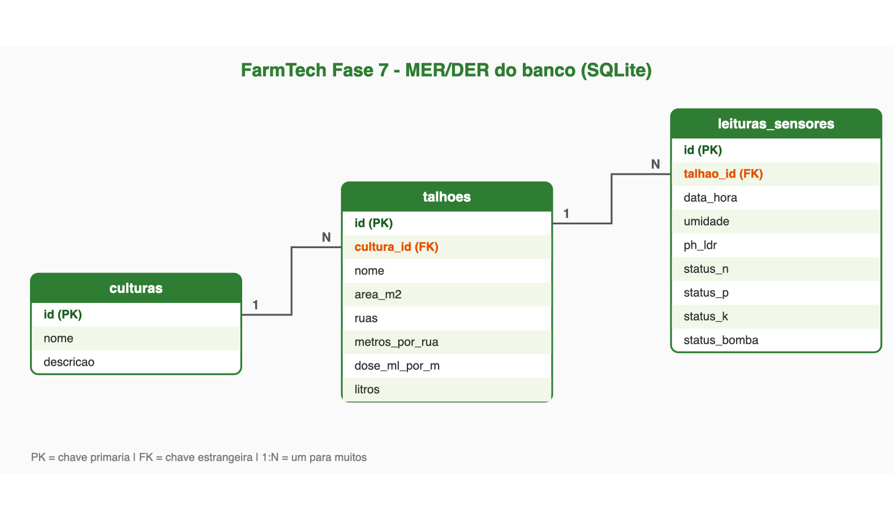

# FarmTech Solutions — Fase 7 · Documentação das Fases 1, 2 e 3 (Pessoa 1)

Esta parte do projeto cobre a **base de dados (Python + R)**, o **banco de dados
relacional** e o **IoT (ESP32)**, integrados pelo fluxo:

> **sensor → decisão da bomba → CRUD → banco de dados**

## Os 2 objetos agrícolas monitorados

O sistema monitora dois talhões de culturas diferentes:

| Cultura | Geometria do talhão | Cálculo de área |
| ------- | ------------------- | --------------- |
| **Café** | Retangular | `comprimento × largura` |
| **Soja** | Circular (pivô central) | `π × raio²` |

As duas culturas já entram cadastradas no banco automaticamente (seed do `schema.sql`).

## Estrutura da minha parte

```
farmtech_fase7/
├── fase1_base_dados/
│   ├── calculo_area.py          # área e volume de plantio
│   ├── manejo_insumos.py        # doses de fertilizante/defensivos
│   ├── api_meteorologica.py     # consome a Open-Meteo e gera o CSV
│   ├── analise_r.R              # estatística dos dados meteorológicos
│   └── dados_meteorologicos.csv # base gerada pela API (alimenta o R)
├── fase2_banco_dados/
│   ├── schema.sql               # DDL: tabelas, FKs, índices, seed
│   ├── conexao_db.py            # conexão reutilizável + criar_banco()
│   ├── crud_operacoes.py        # CRUD do manejo agrícola (talhões)
│   └── mer_der.png              # diagrama do banco
└── fase3_iot/
    ├── esp32_irrigacao.ino      # sketch do ESP32 (hardware real, Wokwi)
    ├── sensor_dht22.py          # leitura de umidade/temperatura
    ├── sensor_ldr_ph.py         # simulação de pH via LDR
    ├── logica_bomba.py          # regra de irrigação (igual ao .ino)
    └── crud_sensores.py         # grava as leituras no banco (Fase 2)
```

> **Sem dependências externas de Python**: tudo roda com a biblioteca padrão
> (`sqlite3`, `urllib`, `csv`, `json`, `math`, `random`). Só o `analise_r.R`
> precisa do **R** instalado (usa apenas R base).

---

## Fase 1 — Base de dados (Python + R)

### `calculo_area.py`
Funções puras de geometria do talhão:
- `area_retangular(comprimento, largura)` → café
- `area_circular(raio)` → soja
- `volume_preparo_solo(area, profundidade=0.20)` → volume de solo preparado (m³)

### `manejo_insumos.py`
- `litros_por_linha(ruas, metros_por_rua, dose_ml_por_m)` → litros de insumo líquido.
  Fórmula: `ruas × metros × (dose_mL/m ÷ 1000)`.
- `fertilizante_por_area(area_m2, dose_kg_por_ha)` → kg de fertilizante (1 ha = 10.000 m²).

### `api_meteorologica.py`
Consome a **Open-Meteo** (pública e **sem chave de API**) e grava
`dados_meteorologicos.csv` com leituras horárias (temperatura, umidade,
precipitação e vento) da região de Ribeirão Preto/SP.

> Trocamos o OpenWeatherMap (que exige API key) pela Open-Meteo justamente
> para qualquer pessoa rodar sem configurar credenciais.

### `analise_r.R`
Lê o CSV e calcula **média, desvio padrão, mínimo e máximo** de cada variável,
mais uma leitura agronômica simples sobre a umidade média. Usa só R base.

### Como rodar a Fase 1
```bash
cd fase1_base_dados
python3 calculo_area.py
python3 manejo_insumos.py
python3 api_meteorologica.py     # gera/atualiza o dados_meteorologicos.csv
Rscript analise_r.R              # precisa do R instalado
```

---

## Fase 2 — Banco de dados relacional (SQLite)

Usamos **SQLite**: o banco é um arquivo único (`farmtech.db`), sem servidor,
então qualquer integrante ou avaliador clona o repositório e roda na hora.
(Na Fase 3 original o banco era Oracle, importado pela interface do SQL Developer.)

### Diagrama MER/DER



### As 3 tabelas
- **`culturas`** — domínio com as 2 culturas (café, soja).
- **`talhoes`** — manejo agrícola (área, ruas, insumos). FK → `culturas`.
- **`leituras_sensores`** — leituras do IoT (umidade, pH, NPK, bomba). FK → `talhoes`.

Relação: **cultura `1 : N` talhão `1 : N` leitura**.

As colunas de status usam `CHECK` para só aceitar valores válidos
(`OK`/`FALTA` para NPK, `LIGADA`/`DESLIGADA` para a bomba, umidade 0–100, pH 0–4095).

### Arquivos
- **`schema.sql`** — todo o DDL (cria tabelas, FKs, índices e já insere café/soja).
- **`conexao_db.py`** — `conectar()` abre o banco com FK ligada; `criar_banco()` recria tudo a partir do `schema.sql`.
- **`crud_operacoes.py`** — `inserir_talhao`, `listar_talhoes`, `atualizar_talhao`, `deletar_talhao`.

### Setup do banco
```bash
cd fase2_banco_dados

# Opção A — via Python (recomendado)
python3 conexao_db.py            # cria o farmtech.db e lista as tabelas

# Opção B — direto pelo SQLite
sqlite3 farmtech.db < schema.sql

# Testar o CRUD dos talhões
python3 crud_operacoes.py
```

---

## Fase 3 — IoT (ESP32)

### Hardware (sketch `esp32_irrigacao.ino`)
Simulado no **Wokwi**: 👉 https://wokwi.com/projects/444286931892308993

| Componente real | Simulação | Pino | Função |
| --------------- | --------- | ---- | ------ |
| Umidade do solo | DHT22 | 15 | mede umidade (%) |
| pH do solo | LDR | 34 (ADC) | valor 0–4095 representando o pH |
| Nutrientes N/P/K | 3 botões | 21/22/23 | alerta de deficiência |
| Bomba d'água | Relé | 4 | liga/desliga a irrigação |

**Regra de irrigação** (a bomba só liga se TODAS forem verdadeiras):
1. umidade **< 60%**
2. pH (LDR) entre **1500 e 2500**
3. **nenhum** nutriente em falta

### Versão em Python
Como nem todo mundo tem a placa, a mesma lógica roda em Python para alimentar
o banco e a dashboard:
- `sensor_dht22.py` → leitura de umidade/temperatura (simulada)
- `sensor_ldr_ph.py` → valor do LDR (0–4095) + conversão para pH (0–14)
- `logica_bomba.py` → `decidir_bomba(...)` com a **mesma regra do `.ino`**
- `crud_sensores.py` → lê os sensores, decide a bomba e **grava no banco**

### Como rodar a Fase 3
```bash
cd fase3_iot
python3 logica_bomba.py          # testa a regra da bomba
python3 crud_sensores.py         # simula leituras e grava no banco
```

---

## Fluxo completo: sensor → CRUD → banco

```
[sensor_dht22] umidade ─┐
[sensor_ldr_ph] pH ─────┼──► [logica_bomba] decide LIGADA/DESLIGADA
[NPK simulado] ─────────┘            │
                                     ▼
                         [crud_sensores] grava a leitura
                                     │
                                     ▼
                    [banco SQLite] tabela leituras_sensores
                        (FK → talhoes → culturas)
```

Cada leitura fica ligada a um **talhão** (FK `talhao_id`), e cada talhão a uma
**cultura** (FK `cultura_id`) — por isso é possível responder, por exemplo,
"todas as leituras do talhão de café".

---

## Resumo: rodar tudo do zero

```bash
# 1) cria o banco com as 2 culturas
cd fase2_banco_dados && python3 conexao_db.py && cd ..

# 2) cadastra talhões (manejo agrícola)
cd fase2_banco_dados && python3 crud_operacoes.py && cd ..

# 3) gera dados meteorológicos e analisa em R
cd fase1_base_dados && python3 api_meteorologica.py && Rscript analise_r.R && cd ..

# 4) simula os sensores e grava leituras no banco
cd fase3_iot && python3 crud_sensores.py && cd ..
```

## Decisões técnicas (resumo)
- **SQLite** em vez de Oracle → roda em qualquer máquina sem servidor nem credencial.
- **Open-Meteo** em vez de OpenWeatherMap → API pública sem chave.
- **Lógica da bomba duplicada em Python** → permite testar e integrar sem o hardware,
  mantendo exatamente a mesma regra do sketch do ESP32.
- **`CHECK` constraints no banco** → garantem integridade (só entra dado válido).
